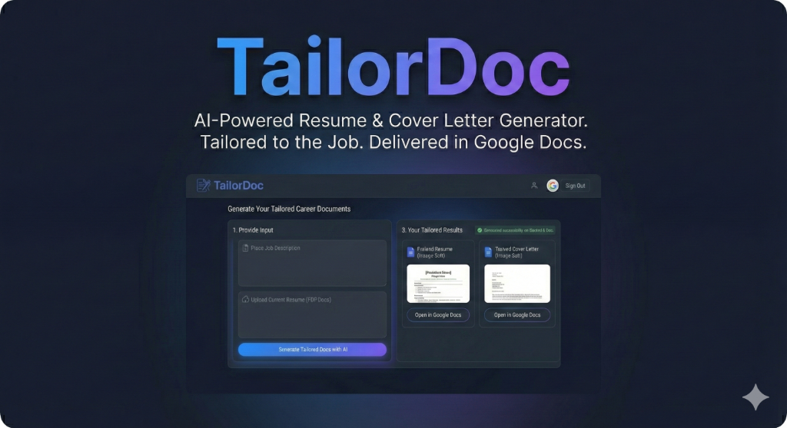

# TailorDoc: AI Resume & Cover Letter Generator


**TailorDoc** is an intelligent career automation tool that rewrites your resume and creates tailored cover letters for specific job applications using Google Gemini 2.0.



## 🚀 Features

*   **Smart Tailoring**: Analyzes job descriptions to highlight your most relevant skills.
*   **Gemini 2.0 Integration**: Uses the latest Google AI models for high-quality writing.
*   **Google Docs Export**: Automatically creates formatted documents in your Google Drive.
*   **n8n Workflow**: Powered by a robust visual workflow engine.
*   **Secure**: API keys are managed server-side and never exposed to the client.

## 🛠️ Architecture

*   **Frontend**: Next.js 14, Tailwind CSS, Framer Motion.
*   **Backend**: Local n8n instance + Next.js API Routes.
*   **Auth**: Google OAuth 2.0 (via `next-auth`).
*   **Storage**: Google Drive & Docs.

## 📦 Installation

### 1. Clone the Repository
```bash
git clone https://github.com/Gabby-vays/tailor-doc.git
cd tailordoc
```

### 2. Install Dependencies
```bash
npm install
```

### 3. Environment Setup
Create a `.env.local` file in the root directory and add your secrets:
```env
# Google OAuth (for Login & Drive Access)
GOOGLE_CLIENT_ID=your_client_id
GOOGLE_CLIENT_SECRET=your_client_secret

# NextAuth Configuration
NEXTAUTH_URL=http://localhost:3000
NEXTAUTH_SECRET=generate_a_random_string_here

# AI Configuration (Server-Side Only)
GEMINI_API_KEY=your_gemini_api_key
```

### 4. n8n Setup
1.  Install n8n locally: `npm install n8n -g`
2.  Start n8n: `n8n start`
3.  Import the workflow file: `AI_Resume_Generator_Integrated.json` (included in repo).
4.  Configure your Google Credentials in n8n.
5.  Activate the workflow.

### 5. Run the Application
```bash
npm run dev
```
Open [http://localhost:3000](http://localhost:3000) in your browser.

## 🔒 Security Note
This project is configured to keep your API keys safe.
*   **Never commit `.env.local`**.
*   The `GEMINI_API_KEY` is only used on the server and is never sent to the browser.

## 📄 License
MIT
